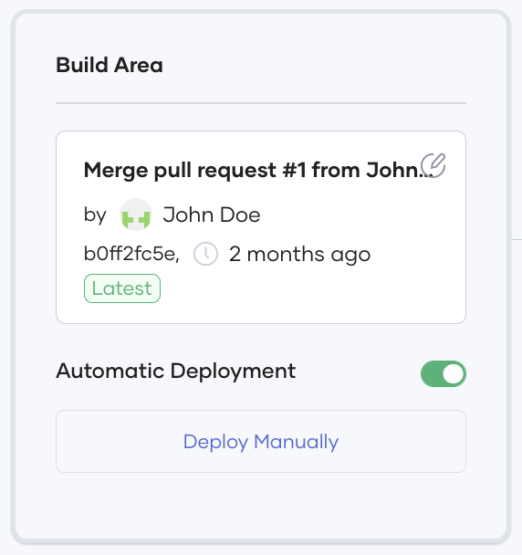

# Deploy Your Component

Deploying your component on Choreo makes it invocable. Once you have designed, tested, and committed the REST API, you can deploy it.

To deploy a component, follow the steps below:

1. Click the **Deploy** icon. 

2. **Automatic Deployment** is enabled by default. If you want do not want Choreo to automatically deploy the component after each commit that edits its implementation, you can disable automatic deployment,

3. Then in the **Build Area** card, click **Deploy Manually**.
    
    !!! info
        Choreo requires you to perform the first deployment of each component manually so that you can provide values for any configurable variables that the implementation may include.

    {.cInlineImage-full}

2. You can view the progress of the deployment from the console.

    {.cInlineImage-full}

Once you deploy the component, the **Development** card indicates that it is active.

{.cInlineImage-full}

Now you can test your deployed component to check if it is working as expected.
